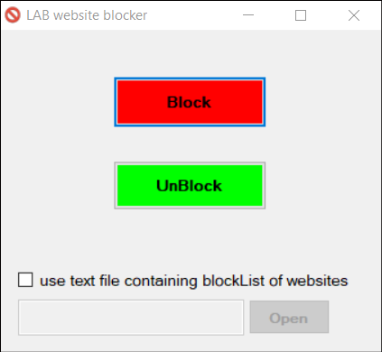

# Lab website blocker
Author: (@journey6)

GUI application written in C# to block websites that can be used in school Labs to prevent students from getting busy with such websites like watching videos on Youtube ... etc

It works on both Windows 7 and 10 (on Windows 10 it may ask you to accept downloading .Net framework 3.5 because it is intended to work on both Win7/10)

update 2 changelog:
- now you can use external text file which contains your own blockList of websites (no need to use hardcoded list but it is still available)
- used 0.0.0.0 for hosts file in order to block websites instead of 127.0.0.1, this way is better not to waste resources of local web server if any

List of hardcoded websites that can be blocked: ( or you can add your own list with text file)

youtube.com www.youtube.com  
twitch.tv www.twitch.com  
movs4u.tv www.movs4u.tv  
twitter.com www.twitter.com  
aflam.io www.aflam.io  
dailymotion.com www.dailymotion.com  
vimeo.com www.vimeo.com  
metacafe.com www.metacafe.com  
d.tube www.d.tube  
whatsapp.com www.whatsapp.com web.whatsapp.com  
facebook.com www.facebook.com m.facebook.com   
instagram.com www.instagram.com  
ask.fm www.ask.fm  
myspace.com www.myspace.com  
veoh.com www.veoh.com  
fushaar.com www.fushaar.com  
te3b.com www.te3b.com  
9gag.com www.9gag.com  
tiktok.com www.tiktok.com  
netflix.com www.netflix.com  
flickr.com www.flickr.com  
hulu.com www.hulu.com  
cimaclub.com www.cimaclub.com  
mycima.me www.mycima.me  
cima4u.tv www.cima4u.tv  
movizland.com on.movizland.com www.movizland.com  
egbest2.com w.egbest2.com www.egbest2.com  
e3rfezai.com www.e3rfezai.com  
