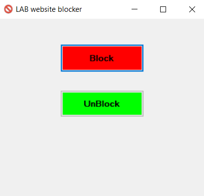

# Lab_website_blocker
Author: (@journey6) Hussain

GUI application written in C# to block websites that can be used in school Labs to prevent students from getting busy with such websites like watching videos on Youtube ... etc

It works on both Windows 7 and 10 ( on Windows 10 it may ask you to accept downloading .Net framework 3.5 )

Currently this version includes a list of website already hard-coded but in the future I will include text file to read website list, that user wants to block

List of websites that can be blocked: ( or you can add your own list in the code and compile it)

 youtube.com www.youtube.com   
 twitch.tv www.twitch.com   
 movs4u.tv www.movs4u.tv   
 twitter.com www.twitter.com   
 aflam.io www.aflam.io   
 dailymotion.com www.dailymotion.com   
 vimeo.com www.vimeo.com   
 metacafe.com www.metacafe.com   
 d.tube www.d.tube   
 whatsapp.com www.whatsapp.com web.whatsapp.com   
 facebook.com www.facebook.com   
 instagram.com www.instagram.com   
 ask.fm www.ask.fm   
 myspace.com www.myspace.com   
 veoh.com www.veoh.com   
 fushaar.com www.fushaar.com   
 te3b.com www.te3b.com   
 9gag.com www.9gag.com
